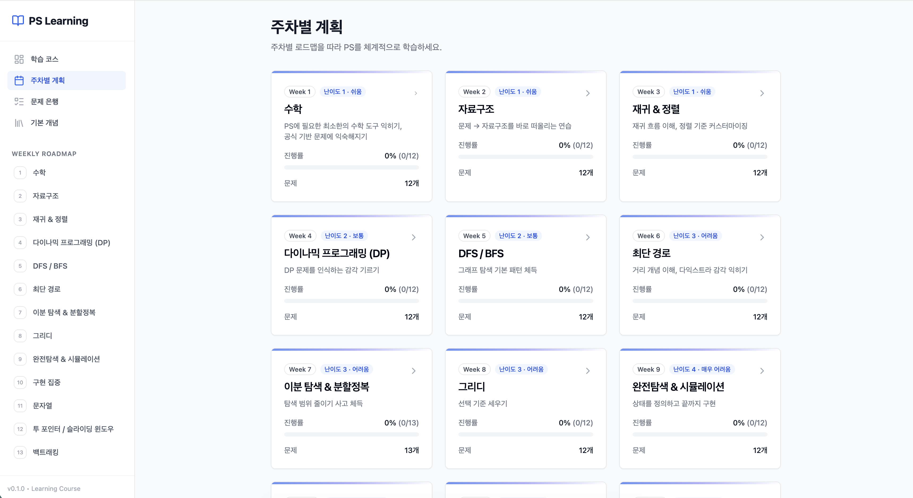

# 알고리즘 문제 풀이(PS) 학습 로드맵 & 관리 도구

> **로그인 없이 바로 시작하는 나만의 알고리즘 공부 코스!**  
> [🚀 Live Demo 바로가기](https://ps-learning-course.vercel.app)

주차별 체계적인 로드맵부터 기본 개념 학습, 문제 관리, 그리고 풀이 노트 기록까지 한곳에서 관리하세요.




---

## 🚀 왜 이 프로젝트를 만들었나요?

알고리즘 공부는 단순히 문제를 많이 푸는 것보다 **체계적인 로드맵**을 따라가며 **사고방식을 정립**하는 것이 중요합니다. 이 프로젝트는 다음의 핵심 가치를 제공합니다:

1. **로그인 없는 즉시성**: 번거로운 가입 절차 없이 브라우저 로컬 저장소(LocalStorage)를 활용해 즉시 학습을 시작하고 기록할 수 있습니다.
2. **주차별 체계적 로드맵**: 각 주차별로 반드시 익혀야 할 **기본 개념 학습**과 대표적인 사고방식을 가이드합니다.
3. **효율적인 문제 관리**: TODO / DONE / RETRY 상태 관리를 통해 복습이 필요한 문제를 놓치지 않게 도와줍니다.
4. **풀이 노트 & 코드 아카이브**: 마크다운 기반의 메모와 코드 에디터를 제공하여, 나만의 알고리즘 노트를 만들어갈 수 있습니다.

---

## ✨ 주요 기능

- 🗺️ **학습 코스(홈)**: 전체적인 진행 상황과 알고리즘 학습 로드맵의 개요를 한눈에 파악합니다.
- 📚 **주차별 개념 학습**: 각 주차별 목표, 핵심 학습 포인트, 체크리스트를 통해 기본기를 탄탄히 다집니다.
- 📂 **문제 은행(Problems)**: 전체 문제 리스트를 검색하고 유형별(태그)로 필터링하여 관리합니다.
- 📝 **문제 상세 페이지 & 노트**:
  - **마크다운 메모**: 풀이 전략과 아이디어를 자유롭게 기록합니다.
  - **코드 에디터**: 작성한 코드를 기록하고 구문 강조(Highlight)를 통해 명확하게 확인합니다.
  - **PDF 출력**: 기록한 내용을 브라우저 인쇄 기능을 통해 문서로 보관할 수 있습니다.
- 📊 **진도 관리**: 주차별/전체 진행률을 시각적으로 확인하며 성취감을 고취합니다.

---

## 🛠️ 기술 스택

- **Frontend**: React, Vite, TypeScript
- **Styling**: Tailwind CSS, Lucide React (Icons)
- **State Management**: Zustand (+ `persist` middleware for local storage)
- **Routing**: React Router DOM

---

## 🏁 시작하기

### 1) 설치 및 실행

```bash
# 의존성 설치
npm install

# 개발 서버 실행
npm run dev

# 프로덕션 빌드
npm run build
```

---

## 💡 사용 가이드

1. **로드맵 확인**: 홈 화면에서 전체적인 학습 흐름을 확인합니다.
2. **개념 학습**: 해당 주차의 기본 개념과 학습 가이드를 먼저 숙지합니다.
3. **문제 풀이**: 제시된 문제를 풀고 상태(DONE)를 업데이트합니다.
4. **기록 남기기**: 문제 상세 페이지에서 나만의 풀이 코드와 메모를 남겨 나중에 복습할 때 활용합니다.

---

## 📄 라이선스

이 프로젝트는 개인 학습용으로 제작되었으며 자유롭게 수정 및 활용이 가능합니다.
